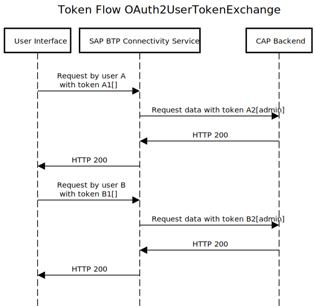
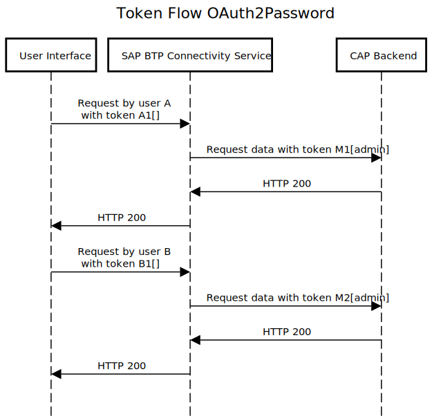

# SAP Tech Bytes - 2021-03-18

This video explains how to embed SAP Fiori Apps in the SAP Fiori Launchpad and how to identify problems while doing so. The video also includes a review of different destination types from our developer advocate Marius.

## Background reading:
[Serverless SAP Fiori Apps on SAP BTP, Cloud Foundry environment](https://blogs.sap.com/2020/10/02/serverless-sap-fiori-apps-in-sap-cloud-platform/)

## You will learn
* How to embed web apps in the SAP Fiori Launchpad
* How to use the site management UI of the SAP Launchpad service
* About the differences between the destination types `OAuth2UserTokenExchange` and `OAuth2Password` 

## Prerequisites
* [Watch the SAP Tech Bytes Video "Creating a Multi-module SAP Fiori Project"](https://github.com/SAP-samples/sap-tech-bytes/tree/2021-02-17-multi-module-fiori-project)

## Diagram

A1 is the first token that has been issued for user A, A2 the second token etc. The brackets indicate the scope that is included in the token. Empty brackets [] mean that there's no scope associated.

The credentials of user M are stored in the destination.

---

[More info about this repository](https://github.com/SAP-samples/sap-tech-bytes)
