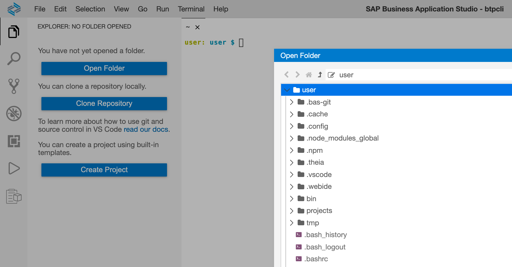

_Understand and manage the btp CLI client configuration._

This is a follow-on post from the previous one: [SAP Tech Bytes: btp CLI - logging in](https://blogs.sap.com/2021/09/07/sap-tech-bytes-btp-cli-logging-in/) and starts where we left off there, with you logged in.

When you connect and authenticate, the connection and login details are stored locally, as we noted from staring at the output from our initial invocation of `btp`.

```
Configuration:                     /home/user/.cache/.btp/config.json
```

This is the default location that `btp` uses.

## App Studio lifecycle

This post and the posts in the rest of this SAP Tech Bytes mini-series is based on running the btp CLI in the SAP Business Application Studio (App Studio). Certain directories in your dev space's work area are cleaned up when a dev space is stopped and restarted.

One of those directories is the `.cache/` directory in your home directory.

If we look at this in detail (with `ls -la | grep .cache`), it's fairly clear that it's ephemeral - in general, in most Unix-like environments, nothing in `/tmp/` is guaranteed to be there after a restart:

```
lrwxrwxrwx  1 root root    20 Sep  7 09:01 .cache -> /tmp/usertemp/.cache
```

Given that this is where `btp` stores configuration, what happens when our App Studio dev space is stopped and then restarted? Well, let's find out.

First, let's make sure that we *are* still logged in, by invoking `btp` with no further parameters. If we're logged in, we should see something like this:

```
SAP BTP command line interface (client v2.8.0)

Usage: btp [OPTIONS] ACTION [GROUP/OBJECT] [PARAMS]

CLI server URL:                    https://cpcli.cf.eu10.hana.ondemand.com (server v2.8.0)
User:                              P0003480944 (sapdeveloper@example.com)
Configuration:                     /home/user/.cache/.btp/config.json

Current target:
  Global account (subdomain: 82715b8dtrial-ga)
  └─ Subaccount (ID: b8a33bf9-b155-4736-aadf-582dae8fd65a)

Tips:
  For information about the targeting mechanism, use 'btp --help target'.
  To display general help, use 'btp --help'.

OK
```

Next, go back to the App Studio "Dev Space Manager", and stop the dev space you created for this adventure (in [SAP Tech Bytes: btp CLI - installation](https://blogs.sap.com/2021/09/01/sap-tech-bytes-btp-cli-installation/)). Once it's stopped, restart it and re-enter it.

> I find the quickest way to get back to the App Studio's "Dev Space Manager" is just to remove the hashpath from the URL; in this example, it would be by removing `#ws-kvhjc` from `https://82715b8dtrial.eu10cf.trial.applicationstudio.cloud.sap/index.html#ws-kvhjc` (this is the dev space's ID).

## Starting over

Now, in a new terminal, first have a look in the `.cache/` directory:

```
ls --all --dereference --recursive .cache/
```

> the options given to `ls` here make sure we see hidden files (`--all`) (remember that `.btp` begins with a dot and is therefore hidden by default), that symbolic links are followed (`--dereference`) and that the list descends recursively (`--recursive`); normally I'd write this as `-aLR`.

You won't see the `.btp/` directory or anything in it, because it's not there any more (the content that is there has just been recreated when the dev space was restarted).

Try `btp` again. This is the result:

```
Welcome to the SAP BTP command line interface (client v2.8.0)

Usage: btp [OPTIONS] ACTION [GROUP/OBJECT] [PARAMS]

CLI server URL:                    not set
User:                              not set
Configuration:                     /home/user/.cache/.btp/config.json

You are currently not logged in.

Tips:
  To log in to a global account of SAP BTP, use 'btp login'. For help on login, use 'btp --help login'.
  To display general help, use 'btp --help'.

OK
```

Uh-oh! But not surprising, given that the configuration is gone. Actually, there *is* some configuration now there, as `btp` will create a `config.json` file on invocation. Use the `ls` command again to see, and you should see (amongst the other content that was there) this:

```
.cache:
.  ..  .btp

.cache/.btp:
.  ..  config.json
```

What's in `config.json`? Basically, this:

```json
{
  "ServerURL": "",
  "SubDomain": "",
  "UserName": "",
  "RefreshToken": "",
  "Directory": "",
  "Subaccount": "",
  "Version": "2.8.0",
  "Authentication": {
    "User": "",
    "Mail": ""
  },
  "TrustedURLs": null,
  "Autocomplete": null
}
```

(although flat, it wasn't prettified like that).

So now we understand why `btp` shows nothing, and that we're not logged in any more.

## Managing our configuration

We need to have the configuration stored in a different place, and used from there, so it persists. Personally, I'm a fan of the [X Desktop Group (XDG) Base Directory Specification](https://specifications.freedesktop.org/basedir-spec.latest.html), which defines environment variables that apps can heed. `XDG_CONFIG_HOME` is one of those, and "_defines the base directory relative to which user-specific configuration files should be stored._". Moreover, it goes on to say: "_If $XDG_CONFIG_HOME is either not set or empty, a default equal to $HOME/.config should be used._". That works as a nice default for me.

The btp CLI allows you to [specify the location of the configuration file](https://help.sap.com/viewer/65de2977205c403bbc107264b8eccf4b/Cloud/en-US/e57288d7f2aa4e59a8f70b08b82a933d.html) either using the `--config` option, which you'll need to specify on each invocation of `btp`, or using the environment variable `SAPCP_CLIENTCONFIG`.

Let's tell the btp CLI that we want our configuration in this location (relative to our home directory):

```
.config/btp/config.json
```

Environment variables are best set when a shell session starts, so let's add the appropriate assignment to `SAPCP_CLIENTCONFIG` in the same file as we added the `bin/` directory to our path. This is the `.bashrc` file in our home directory.

You can edit this file using App Studio of course. First, open your home directory as a folder in the explorer, like this:



Then open the `.bashrc` file, and at the bottom, add content so it looks like this:

```bash
export PATH=$PATH:$HOME/bin
export SAPCP_CLIENTCONFIG=$HOME/.config/btp/config.json
```

Close any existing terminal session and start a new one (Terminal -> New Terminal); this will cause the `.bashrc` file to be processed, and you can then check that the `SAPCP_CLIENTCONFIG` environment variable is indeed now set:

```bash
echo $SAPCP_CLIENTCONFIG
```

It should show you this:

```
/home/user/.config/btp/config.json
```

Now it's time to log back in with the btp CLI. Follow the same login procedure as described in the previous post [SAP Tech Bytes: btp CLI - logging in](https://blogs.sap.com/2021/09/07/sap-tech-bytes-btp-cli-logging-in/). Use the `btp target` command to specify your trial subaccount too.

Invoking `btp` on its own now should show familiar information:

```
SAP BTP command line interface (client v2.8.0)

Usage: btp [OPTIONS] ACTION [GROUP/OBJECT] [PARAMS]

CLI server URL:                    https://cpcli.cf.eu10.hana.ondemand.com (server v2.8.0)
User:                              P0003480944 (sapdeveloper@example.com)
Configuration:                     /home/user/.config/btp/config.json

Current target:
  Global account (subdomain: 82715b8dtrial-ga)
  └─ Subaccount (ID: b8a33bf9-b155-4736-aadf-582dae8fd65a)

Tips:
  For information about the targeting mechanism, use 'btp --help target'.
  To display general help, use 'btp --help'.

OK
```

But note the location of the configuration - it is honouring where we told the btp CLI to keep it. Great!

## Final checks

Go through the process of restarting your dev space once more. When starting a new terminal after that, and invoking `btp`, you should see that your configuration has survived, and you're still logged in. Great!

In the next post, we look at adding a whole ton of comfort to invoking commands with the btp CLI.

---


SAP Tech Bytes is an initiative to bring you bite-sized information on all manner of topics, in [video](https://www.youtube.com/playlist?list=PL6RpkC85SLQC3HBShmlMaPu_nL--4f20z) and [written](https://blogs.sap.com/tag/sap-tech-bytes/) format. Enjoy!
