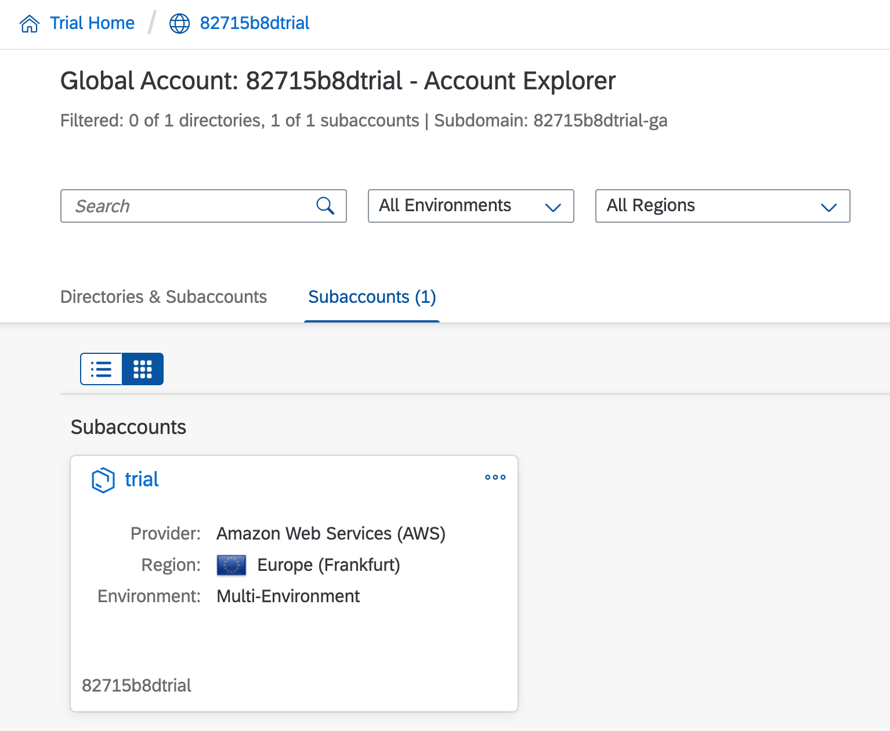

_Start exploring with the btp CLI by logging in, then finding and selecting a subaccount for subsequent activities._

This is a follow-on post from the previous one: [SAP Tech Bytes: btp CLI - installation](https://blogs.sap.com/2021/09/01/sap-tech-bytes-btp-cli-installation/) and assumes you've got it set up according to that post, in an SAP Business Application Studio (App Studio) dev space, with the location of the `btp` binary (in `$HOME/bin/`) added to the environment variable `$PATH` so that you can invoke it simply as `btp`.

Previously I made a brief mention of the client-server nature of the btp CLI. The fact that you're running a command line interface to connect to and control remote services more or less pre-supposes that architecture; moreover, it's a great way for the team to provide an abstraction between the btp CLI command structure and the surface area of the services & entities on the platform itself.

## Invoking btp

Invoke `btp` from a terminal in your App Studio dev space and stare at the output for a moment; it should look something like this:

```
Welcome to the SAP BTP command line interface (client v2.8.0)

Usage: btp [OPTIONS] ACTION [GROUP/OBJECT] [PARAMS]

CLI server URL:                    not set
User:                              not set
Configuration:                     /home/user/.cache/.btp/config.json

You are currently not logged in.

Tips:
  To log in to a global account of SAP BTP, use 'btp login'. For help on login, use 'btp --help login'.
  To display general help, use 'btp --help'.

OK
```

There's a lot to unpack here. Briefly:

* the version of the client (that we downloaded last time) is confirmed as 2.8.0
* the "Usage" shows that there's a well-defined structure to the command syntax
* we connect to a btp CLI server via a URL
* we're not currently logged in
* configuration is stored locally in a JSON file

## Logging in

Initiate the login process:

```
btp login
```

You should see the following prompts, and should respond similar to what's shown here - see below for an explanation of the "Global account subdomain":

```
SAP BTP command line interface (client v2.8.0)

CLI server URL [https://cpcli.cf.eu10.hana.ondemand.com]>
Connecting to CLI server at https://cpcli.cf.eu10.hana.ondemand.com...

Global account subdomain>82715b8dtrial-ga
User>sapdeveloper@example.com
Password>********

Login successful
We stored your configuration file at: /home/user/.cache/.btp/config.json

Current target:
  Global account (subdomain: 82715b8dtrial-ga)

Tip:
  For more information on the targeting mechanism, use 'btp --help target'.

OK
```

In the trial context, which we're in here, the default CLI server that
is suggested (`https://cpcli.cf.eu10.hana.ondemand.com`) is appropriate.


Additionally, the global account subdomain is just your global account identifier with a `-ga` suffix. Here's a screenshot of the temporary trial account I set up for this set of examples, where the relationship between the global account identifier and the global account subdomain can be seen:



Now you've logged in, run `btp` again to see the difference. You should now see the version of the server to which you're connected and authenticated, confirmation of your user identification, and also the "current target", being the global account that you specified (via the subdomain) when you logged in. The output should look something like this:

```
SAP BTP command line interface (client v2.8.0)

Usage: btp [OPTIONS] ACTION [GROUP/OBJECT] [PARAMS]

CLI server URL:                    https://cpcli.cf.eu10.hana.ondemand.com (server v2.8.0)
User:                              P0003480944 (sapdeveloper@example.com)
Configuration:                     /home/user/.cache/.btp/config.json

Current target:
  Global account (subdomain: 82715b8dtrial-ga)

Tips:
  For information about the targeting mechanism, use 'btp --help target'.
  To display general help, use 'btp --help'.

OK
```

> The btp CLI also offers a way to [log in through the browser](https://help.sap.com/products/BTP/65de2977205c403bbc107264b8eccf4b/b2a56a8a222940089fd2704a9c26140d.html), with the `--sso` option.


## Understanding targets

Let's dwell on the "target" concept for a moment, it's important. The btp CLI has a [command context](https://help.sap.com/products/BTP/65de2977205c403bbc107264b8eccf4b/720645a3ed3945bd8d97a670b948ac07.html) for calls. At the outset it's only set at the top level, to the global account that you specified when you logged in. All actions that work at a global account level will by default target this global account.

You'll discover that many of the actions you want to perform with the btp CLI will be at the subaccount level - at the level of your trial subaccount, effectively. You can specify a target subaccount too. Let's do this now. Given that our subaccount is "trial" (as we can see from the screenshot earlier), let's try:

```
btp target --subaccount trial
```

We get this:

```
Subaccount 'trial' does not exist in the current global account. Make sure to provide the ID of a subaccount of the current global account.

Tip:
  To find your subaccount ID, use 'btp list accounts/subaccount'.

ERROR
```

Hmm, ok. Well, let's follow the advice we're given:

```
btp list accounts/subaccount
```

> Pause for a second to consider the `ACTION [GROUP/OBJECT]` command structure we saw earlier - here we're seeing a nice example of that.

There's our trial account in the list that's produced:

```
subaccounts in global account 906b8d84-2f2c-429d-8ce4-c1bf166aeb08...

subaccount id:                         display name:   subdomain:      region:   beta-enabled:   parent id:                             parent type:     state:   state message:
b8a33bf9-b155-4736-aadf-582dae8fd65a   trial           82715b8dtrial   eu10      true            906b8d84-2f2c-429d-8ce4-c1bf166aeb08   global account   OK       Updated tenant status to ACTIVE


OK
```

It's the ID that's required:

```
btp target --subaccount b8a33bf9-b155-4736-aadf-582dae8fd65a
```

> The ID is what you see when selecting "More Info" from the three-dots menu on the "trial" subaccount card in the screenshot we saw earlier.

The result of specifying the ID in the target command is what we're looking for:

```
Targeting subaccount 'b8a33bf9-b155-4736-aadf-582dae8fd65a'.
Commands that only work on global account level will be executed in the parent global account.

Current target:
  Global account (subdomain: 82715b8dtrial-ga)
  └─ Subaccount (ID: b8a33bf9-b155-4736-aadf-582dae8fd65a)

Tips:
  To execute a command in the parent global account, use parameter '-ga' without value.
  To execute a command in a different context, specify the subaccount, directory, or global account in the command.

OK
```

This is already more useful for us with our trial accounts on the Business Technology Platform. It's a good setup with which to continue our journey of discovery.

Let's end this post with a final command, to examine details of our subaccount we're now targetting:

```
btp get accounts/subaccount
```

If we hadn't already specified the subaccount as part of the target, we'd have received an error at this point:

```
Constraint violated - you must provide parameter 'ID'.

Usage: btp [OPTIONS] get accounts/subaccount ID --global-account SUBDOMAIN

ERROR
```

However, because we've stored the identification of our trial subaccount using the `target` command, we get what we're looking for:

```
Showing subaccount details for b8a33bf9-b155-4736-aadf-582dae8fd65a...

subaccount id:         b8a33bf9-b155-4736-aadf-582dae8fd65a
display name:          trial
description:
subdomain:             82715b8dtrial
region:                eu10
created by:
beta-enabled:          true
used for production:   false
parent id:             906b8d84-2f2c-429d-8ce4-c1bf166aeb08
parent type:           global account
state:                 OK
state message:         Updated tenant status to ACTIVE


OK
```

Great! In the next post, we take a quick look at managing configuration.

---


SAP Tech Bytes is an initiative to bring you bite-sized information on all manner of topics, in [video](https://www.youtube.com/playlist?list=PL6RpkC85SLQC3HBShmlMaPu_nL--4f20z) and [written](https://blogs.sap.com/tag/sap-tech-bytes/) format. Enjoy!
